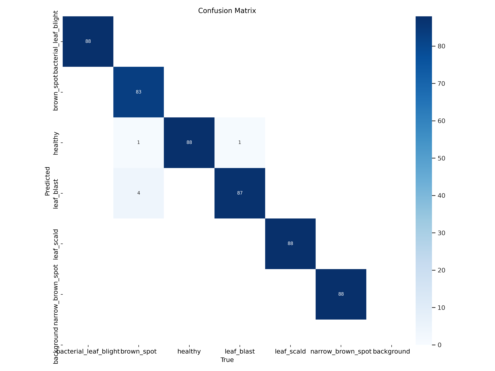
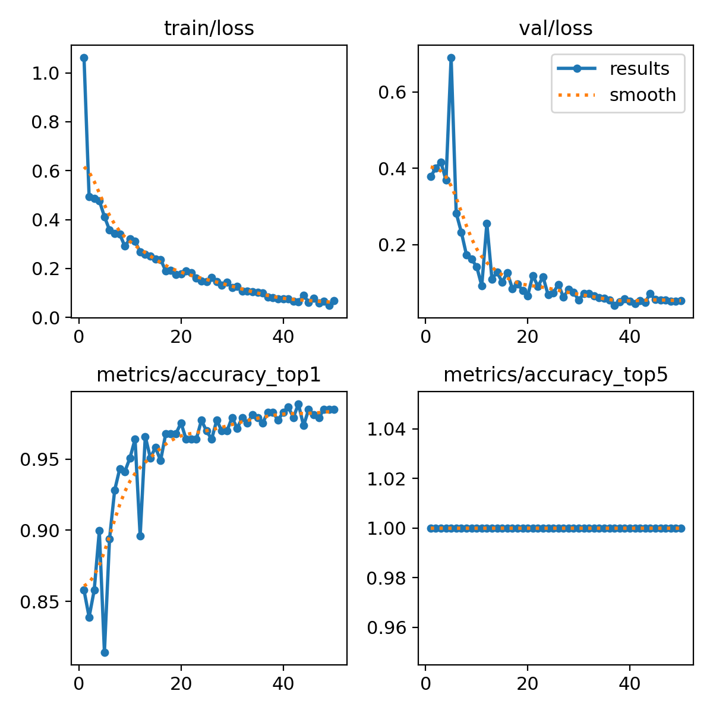
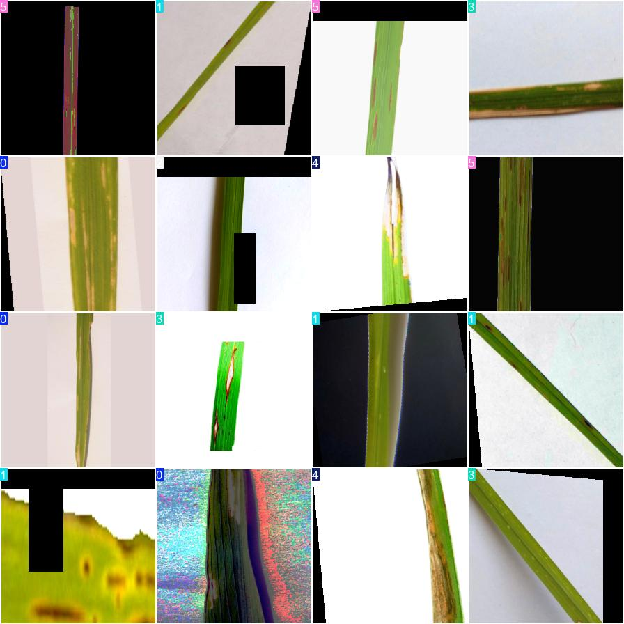
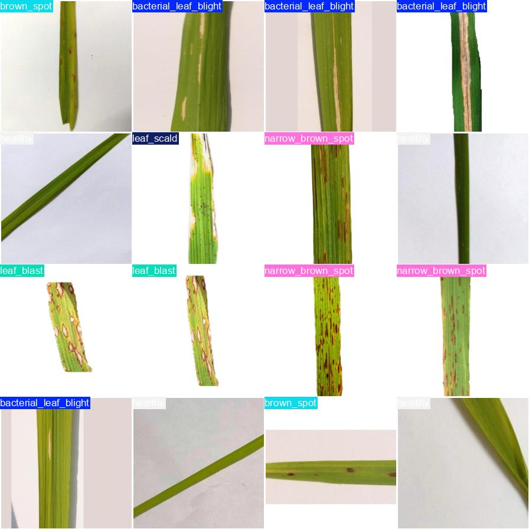

# 📌Rice Leaf Disease Classification


Enhancing Object Detection and Classification with YOLO – A Deep Learning-Powered Solution for Precision and Efficiency!
---

## 🚀 Overview
This project involves object detection and classification using YOLO. The model has been trained and evaluated, with results visualized using confusion matrices and test batch images.

### 🔥 Features
- YOLO-based object detection and classification
- Model training and evaluation
- Performance analysis using confusion matrices
- Predictions on test images

---

## 📂 Project Structure
```
├── args.yaml                        # Model configuration
├── best.pt                          # Trained YOLO model weights
├── code.ipynb                       # Jupyter Notebook for training and inference
├── confusion_matrix.png             # Confusion matrix
├── confusion_matrix_normalized.png  # Normalized confusion matrix
├── events.out.tfevents...           # TensorBoard logs
├── results.csv                      # Model evaluation results
├── results.png                      # Graphical results
├── train_batch0.jpg                 # Sample training batch image
├── val_batch0_labels.jpg            # Validation labels
├── val_batch0_pred.jpg              # Validation predictions
├── video.mp4                        # Video inference results
```

---

## 🛠 Installation & Setup
1. Clone this repository:
   ```sh
   git clone https://github.com/your-username/your-repo.git
   cd your-repo
   ```
2. Install dependencies:
   ```sh
   pip install -r requirements.txt
   ```
3. Run the Jupyter Notebook:
   ```sh
   jupyter notebook
   ```

---

## 📊 Model Performance
Confusion Matrix:


Normalized Confusion Matrix:


Results:


---

## 🎯 Example Predictions
Train Batch Samples:


Validation Predictions:


---

## 🎥 Video Inference
Watch the model in action:
[](video.mp4)

---


## 🤝 Contributing
Contributions are welcome! Feel free to open issues or submit pull requests.

---

## 🌟 Acknowledgments
Thanks to the open-source community for inspiration and support!

---

⭐ **If you find this project useful, don't forget to give it a star!** ⭐

